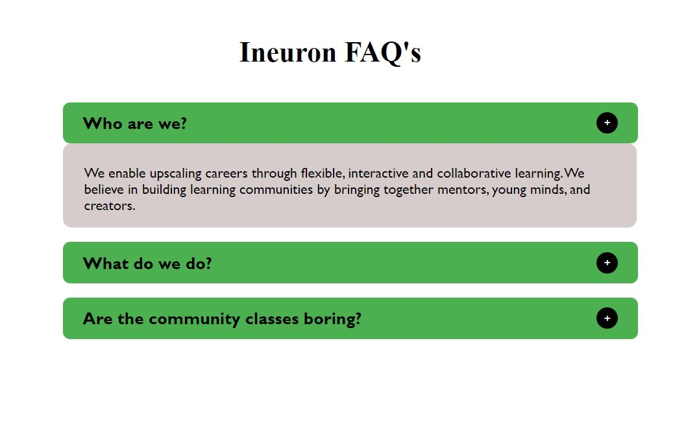

# ⭐ Project - Accordion⭐

This  project of javascript is made from pure HTML,CSS and Javascript.

I got this assignment from iNeuron Bootcamp.

 

📌 Learnings:

👉 1\. HTML, CSS and DOM Manipulation 
👉 2\. How to use toggle property of classlist to hide and show the element. 
👉 3\. Use of For of and foreach loop/HOF to grab the elements. 

 

> Time taken to build this project is 1hr.

  

## Links

[Link](javascriptmyaccordion.netlify.app)

[Linkedin](https://www.linkedin.com/in/pratyush-kesarwani-2b6601171/)

### Acknowledgements:

I am thankful to Hitesh Choudhary sir, Anurag sir and iNeuron team for this amazing bootcamp.
